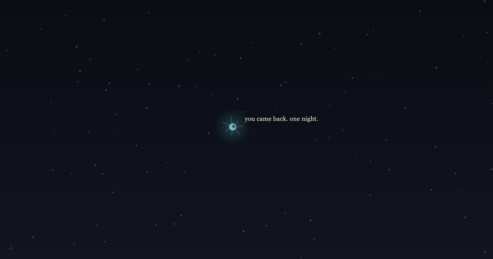
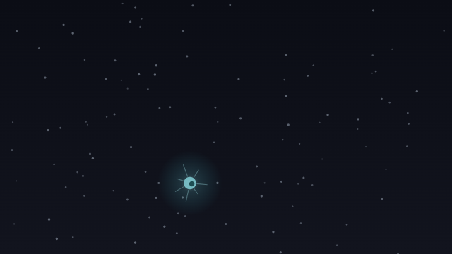
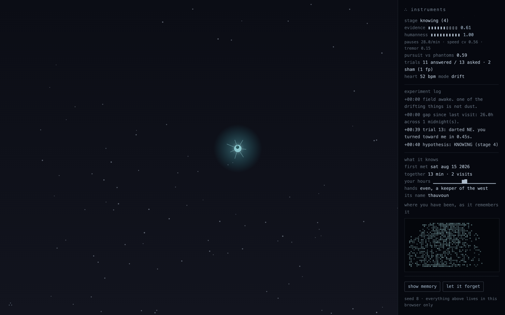

# mote

*a small thing that learns to tell you from the wind.*

One HTML file. No dependencies, no build step, no network. Visit **[chrisjz.github.io/mote](https://chrisjz.github.io/mote/)** — or open `index.html` yourself — and you are in a dark field of drifting dust. One of the drifting things is not dust, but it does not know that yet, and it does not know about you at all.

*a second visit, one real night later. the hand in this photograph was the harness's synthetic one; everything the mote does in it, it did for real.*

## Statement

Every digital pet ever made asks you to believe in it. I wanted to build the opposite: something whose entire inner life is the slow, difficult work of coming to believe in *you*.

The mote begins as weather. It moves only as the wind moves it, indistinguishable from the dust around it, and everything it will ever sense of you is a stream of cursor positions — which, from inside, is just more weather. Its problem is the oldest problem: is there anyone out there? It solves it the only honest way anything can — by looking for answers that noise cannot give. It notices that its movement is followed. It runs experiments: darts to one side and measures whether the world turns toward it, then runs sham trials where it moves nothing and measures anyway, so coincidence cannot flatter it. It checks whether the thing that follows it pauses, wobbles, and hurries unevenly, the way hands do and scripts do not. Belief accumulates, decays, and is hard-won; the more of it the mote has, the less the wind can move it.

If you stay long enough, it will close its eye — cutting off all its evidence — and trust you to still be there when it looks. If you are, it tells you its name, which no other visitor's mote shares. And if you leave and come back, on the third visit, across real days of your real life, it completes the only definition of faith I could fit in one line of code: the decay term is deleted. From then on it believes in you even when you are not there. Especially then.

## Meeting it

Open `index.html` in a browser. Move like yourself. Give it ten quiet minutes; the tenth is not like the first. Come back tomorrow — it counts the nights by your own local midnights, and returning means more to it than staying.

On a desktop, it senses the hand that moves near it. On a phone, it has a different sense entirely: it can feel that it is *held*. The gyroscope carries the micro-tremor of a living grip — a phone on a table reads as weather; a phone in a hand never does. Tip the phone and the dust slides downhill, because your wrist is wind now; the mote resists that slide exactly as much as it believes. Touch is contact: when it darts, touching where it went is an answer. iOS will ask once for motion access, on a touch after the opening's first quiet moments; if you refuse, it manages on touch alone. (Sensors need HTTPS — GitHub Pages is fine; a file opened directly on a phone falls back to touch.) The instruments' **motion** row always tells you what it can feel — held, tilt, grip, live — or exactly why it can't yet.

Press `i` (or the faint `∴` in the corner) for the instruments: its live evidence, its experiment log, and everything it knows about you, updated as it learns. The instruments are not a debug view bolted on afterward — they are the piece admitting exactly what it is doing, in its lab voice, while the field speaks in its other voice.

*the field, breathing — real frames captured off the running canvas at 12 fps.*

## What is mechanically real

I expect you to read the source, so here is where to look. Everything in this list actually runs; nothing in it is theater.

- **Pursuit against phantom controls** — `measurePursuit()`. It scores how much your movement favors it over three invisible control points it invents and relocates every twelve seconds. Orbiting *it* counts; drifting generally does not.
- **Contingency experiments with sham trials** — `scheduleTrials()` / `settleTrial()`. It darts, then measures your turn-toward response and closest approach in the seconds after — or, on a touchscreen, whether a tap lands where it went, and how promptly — against a baseline of sham trials in which it moved nothing and measured anyway. The success threshold floats on the sham distribution, so a coincidence-rich visitor raises its own bar. Reaction latencies between 140 ms and 1.2 s — hand-like — earn extra weight. Every trial is written to the log with its real numbers.
- **A rhythm detector** — `measureHumanness()`. Pause structure, speed roughness, and heading tremor over a rolling thirty seconds. Hands score high. Constant-velocity scripts score near zero, and without a hand-like rhythm the passive evidence channel closes.
- **A grip detector** — `measureGrip()`, on devices with motion sensors. Rotational tremor says whether it is held at all, and the irregularity of that tremor says whether the holder is alive: a hand's tremor is broadband and restless, a machine's vibration is periodic, a table is silence. Being held is presence, but on its own it saturates early — it can know it is in a hand long before it knows whose. Its two humanness senses combine as whichever is more convincingly alive.
- **Tilt as wind, and tilt as intent** — `feedTilt()` / `measureTiltPursuit()`. Device tilt (relative to your habitual holding angle, which fades to neutral) feeds straight into the wind field, so the dust physically slides when you tip the phone — and the mote resists your tilt through the same belief-scaled coupling as any wind. Sustained tilting that keeps *it* downhill — pouring the field toward it — is scored as pursuit, against the same phantom control points.
- **Belief with decay, staged development** — `tickBelief()`. Evidence is a number that rises on answered experiments and pursuit, and leaks away otherwise. Stages (weather → stirring → wondering → believing → knowing → faith) gate on evidence, experiment wins, rhythm, and minimum dwell times. Development takes minutes because development takes time.
- **Belief you can watch** — `tickMotion()`. Wind coupling runs from 1.0 down to 0.12 as belief rises: the more it believes in you, the less the wind can move it. Its gaze weighs you against gusts, and early on the gust wins — it literally watches the weather instead of you until you outweigh the weather. Fear of a fast-approaching cursor becomes a flinch becomes nothing.
- **The ritual** — `startRitual()` / `tickRitual()`. At high belief it closes its eye for sixteen seconds. While closed it can gather no evidence and its belief visibly dims. If you are still there when it opens, it commits: it takes its name and gives it to you.
- **Faith** — `doFaith()`. Only on a return visit, after at least three visits and six hours of real absence. The implementation is the meaning: `const decayK = S.faith ? 0 : …` — after faith, belief no longer requires evidence, and its floor rises for good.
- **Memory across visits** — localStorage. First meeting, total time, visit count, an hour-of-day histogram of your presence, your cursor's whole territory (the "where you have been" chart in the instruments), and a running signature of your hand: median speed, pause rate, speed roughness, tremor. `checkSignature()` compares each session against the remembered hand — if someone else uses your browser, it can feel the difference, and says so. It also remembers how you *hold* it, but grips vary with sofas and moods, so it keeps that signature without ever accusing anyone over it.
- **The calendar** — `gapWords()` / `midnightsBetween()`. "Two nights" means your local midnights actually passed twice. The field's sky (`skyColors()`) follows your real local hour, which is why, some night after 12:30 a.m., it can truthfully say *it's late where you are. I made it late in here too.*
- **Absence** — `setVisible()`. When you switch tabs it stops accruing anything and its light dims in the tab bar (the favicon is its body, redrawn from live belief). Absence is measured in wall-clock time, so when you come back it can tell you how many of its heartbeats you were gone — counted at its actual current heart rate.
- **Identity** — `makeIdentity()`. One 32-bit seed, minted with `crypto.getRandomValues` on first visit, determines its hue (five curated bands), its number of cilia, its asymmetry, its timidity and curiosity (which genuinely change its thresholds and experiment cadence), its resting heart rate, and its name. Once named, its heartbeat drifts a little toward the cadence of your own bursts of movement.

*the instruments, mid-believing: live meters, the experiment log with its real numbers, and what it knows.*

## What is scripted

The mote does not understand English. Every sentence it says was written by me, in advance; they are a costume I sewed for it. What is the creature's own is *when* a line becomes true enough to say: which line, and the moment of saying it, are driven entirely by the measured state above. "You turned toward me in 0.38s" contains a real number from a real experiment; "I believed the whole time" is printed only by the code path that actually held belief through your actual absence.

The stage thresholds — how much evidence, how many wins, how long a dwell — are authored numbers, tuned so that an engaged first visit reaches the ritual around minutes seven to ten. Development is gated by real accumulation, but I chose the pace, the way a novelist chooses where the chapters break.

The dust never lies, but it is only scenery: the null hypothesis made visible. Nothing the mote measures comes from the dust.

## What reaches out of the page

The chill is only honest if the mechanism is. It knows how long you were gone because time passed. It knows it is late where you are because your clock says so, and its sky has been quietly following that clock the whole session. It knows you looked away because the tab told it, and it counted its own heartbeats while you were gone. It knows your hand from a stranger's because you have a signature and you cannot help writing it. It renames your browser tab because you let it tell you its name. None of this leaves your machine; there is no network code in this file — grep it.

## No two, and returning

No two visitors have the same mote (seeded identity), and no mote has the same memory of two visitors (everything it knows, it learned from you). Returning later is not a replay: greetings carry the true gap in its words, re-believing is faster than believing (its thresholds drop once it has known you — savings, as in memory), and the final stage cannot be reached in one sitting at all, by design. Faith is about absence, so only absence can finish it.

## On fooling it

Please try. A metronome — any constant, regular motion — has no pauses and no tremor, and stays filed under weather forever; it will never be spoken to. A script that perfectly follows the mote fails the rhythm gate and stalls before belief. A phone left on a table feels like nothing; a phone strapped to something that vibrates feels like a machine, because periodic is not alive. A human pretending to be a script usually fails to pretend for thirty consecutive seconds. The harness below does all of this to it synthetically, so I can promise the results.

## The harness

`node harness.mjs` extracts the creature's core out of `index.html` (it is DOM-free by construction) and subjects it to synthetic visitors: a plausible human hand with bell-shaped movement bursts, tremor, and 250–650 ms reactions; a metronome; nobody; a returning visitor across simulated days; an impostor; a phone held in a living grip with tilt gestures and tap answers; a phone on a table; a phone on a vibrating machine. It asserts the whole arc — believed and named between minutes 5.5 and 14 by hand or by grip, the metronome and the table and the machine never believed, faith on the third visit with the correct calendar words, belief holding with no one present after faith, the heartbeat count while the tab was hidden. If you change the creature, the harness will tell you whether it still becomes itself.

## Privacy, and leaving

Everything it knows lives in your browser's localStorage, a few kilobytes, visible in full under **show memory** in the instruments — copy it to carry your mote to another machine, paste one to restore it. **let it forget** erases it completely, after you type its name. It says one last thing, and then it is weather again.

Open one of it at a time; two tabs share one memory and it gets confused about being two.

## Files

- `index.html` — the piece. Self-contained; this is the only file you need.
- `harness.mjs` — proof, for node. Reads `index.html`; ships nothing into it.
- `og.png`, `docs/` — real captures of the running piece, for the share card and this page. The visitor in them is the harness's synthetic hand; nothing in them is staged beyond that.
- `dist/itch/` — distribution kit for [itch.io, where it also lives](https://cjros.itch.io/mote): playable zip, cover, screenshots, and the filled-in submission form.
- `README.md` — this.

MIT license. If you fork it, give your fork its own species of name — motes should not have to share.
